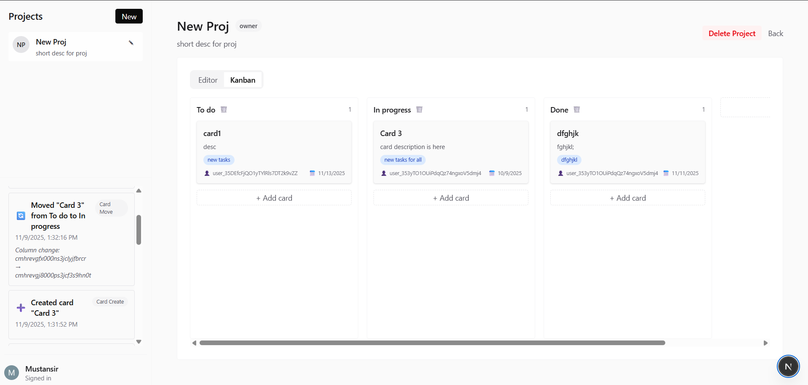
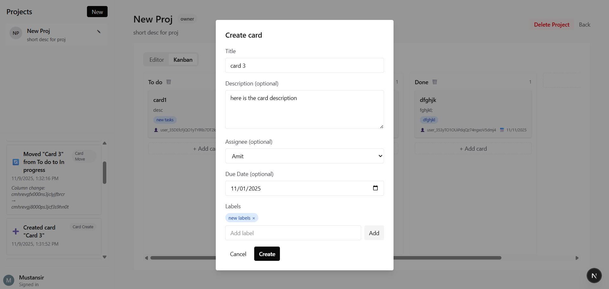
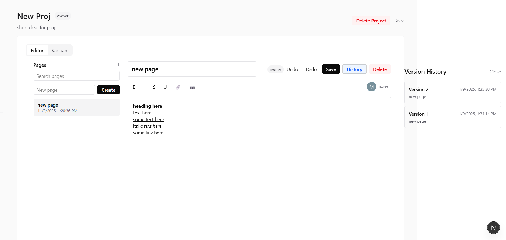

# Froncort Assignment

A lightweight, collaborative project management tool combining rich-text documentation with Kanban boards. Built with Next.js, TipTap, and Prisma.

**Live Site here:** [link](https://froncort-vu2x-git-master-mustansir101s-projects.vercel.app/?_vercel_share=MQzlsAQZf9s75H76GZZWo7ijHcXugdr5)

## Screenshots





## Features

### 📝 Rich-Text Collaborative Editor

- **Real-time collaboration** powered by Yjs and WebSockets
- **Live cursor indicators** showing other users editing simultaneously
- **Rich formatting**: headings, lists, code blocks, links, images, tables
- **Mentions system** with `@user` autocomplete and toast notifications
- **Autosave** with seamless content synchronization
- **Markdown shortcuts** for rapid formatting

### 📋 Version History

- Automatic versioning on every page save
- View complete history of page changes
- Restore previous versions with one click
- Track author and timestamp for each version

### 🎯 Kanban Boards

- Configurable columns with drag-and-drop cards
- **Rich card details**:
  - Title and description
  - Labels (colored badges)
  - Assignees (team member dropdown)
  - Due dates
- Smooth animations and inline editing
- Visual indicators for card states

### 🔔 Activity Feed

- Real-time activity tracking for:
  - Card creation, moves, and edits
  - User mentions in documents
  - Card assignments
  - Page edits
- Project-specific activity filtering
- Auto-refresh every 30 seconds
- Integrated in sidebar for quick access

### 🎨 Multi-Project Support

- Sidebar navigation for switching between projects
- Each project has isolated pages and boards
- Project creation and management

### 🔐 Authentication & Access Control

- Secure authentication via Clerk
- User-based access to projects
- Profile management and Account Settings using Clerk
- Protected routes and API endpoints

## Tech Stack

- **Frontend**: Next.js 16, React 19, TypeScript
- **Editor**: TipTap (ProseMirror-based)
- **Real-time**: Yjs, y-websocket, y-prosemirror
- **Database**: PostgreSQL with Prisma ORM
- **Authentication**: Clerk
- **Styling**: Tailwind CSS
- **UI Components**: Radix UI, Lucide Icons
- **State Management**: Zustand, Immer
- **Notifications**: Sonner

## Getting Started

### Installation

1. Install dependencies:

```bash
pnpm install
```

2. Set up environment variables:

```bash
# Create .env file with:
DATABASE_URL="your_postgresql_connection_string"
NEXT_PUBLIC_CLERK_PUBLISHABLE_KEY="your_clerk_publishable_key"
CLERK_SECRET_KEY="your_clerk_secret_key"
```

3. Run database migrations:

```bash
npx prisma generate
npx prisma db push
```

4. Start the development server:

```bash
pnpm dev
```
